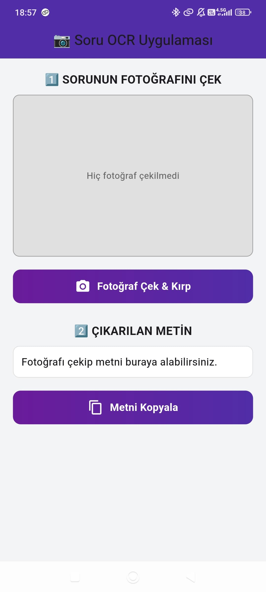
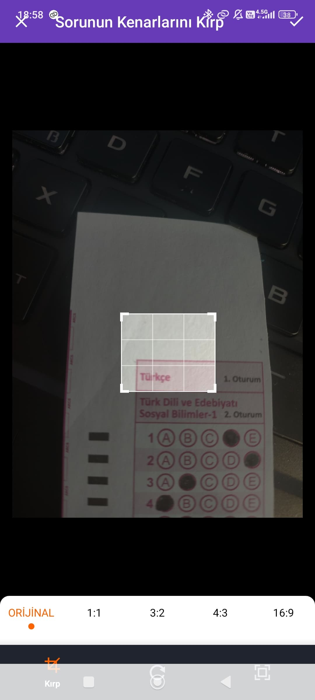
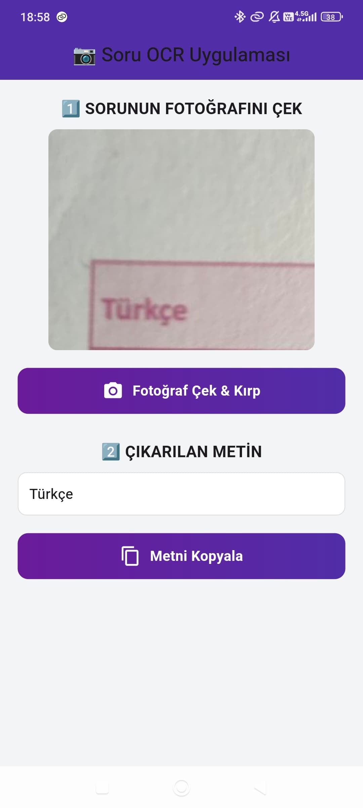

# 📷 Soru OCR Mobil Uygulaması

Bu proje, Flutter ile geliştirilmiş, **mobil cihaz kamerası** kullanarak el yazısı veya basılı metinlerin fotoğrafını çekip, metni otomatik olarak tanıyan bir OCR (Optik Karakter Tanıma) uygulamasıdır.

---

## 🚀 Temel Özellikler

- Kamera ile fotoğraf çekip kırpma
- Otomatik metin (OCR) tanıma ve analiz
- Metni kolayca panoya kopyalama
- Kullanıcı dostu, sade ve modern arayüz

---

## 🖼️ Uygulama Ekran Görüntüleri

### Başlangıç ve Fotoğraf Çekme Ekranı



### Fotoğraf Kırpma Özelliği



### Metin Analizi ve Kopyalama



---

## ⚙️ Kurulum ve Kullanım

1. **Projeyi indirin veya klonlayın:**
    ```bash
    git clone https://github.com/omer-faruk-akbas/ocr-mobil-uygulama.git
    ```
2. **Flutter SDK kurulu olduğundan emin olun.**
3. Proje klasöründe terminal açın ve bağımlılıkları yükleyin:
    ```bash
    flutter pub get
    ```
4. Gerçek cihaz veya emulator ile çalıştırmak için:
    ```bash
    flutter run
    ```

> Uygulama ilk açıldığında, **kamera ve dosya erişim izni** istemektedir.

---

## 💡 Kullanılan Teknolojiler

- [Flutter](https://flutter.dev/)
- [google_mlkit_text_recognition](https://pub.dev/packages/google_mlkit_text_recognition)
- [image_picker](https://pub.dev/packages/image_picker)
- [image_cropper](https://pub.dev/packages/image_cropper)

---

## 📄 Proje Açıklaması

- Kullanıcı, uygulama üzerinden fotoğraf çekebilir veya galeriden görsel seçebilir.
- Kırpma işlemi ile istenilen alan net olarak belirlenir.
- Google ML Kit’in OCR servisiyle metin otomatik olarak tanınır.
- Çıkarılan metin, ekranda kolayca görüntülenir ve tek tuşla panoya kopyalanabilir.

---

## 👨‍💻 Katkıda Bulunmak

Katkı sağlamak isterseniz, lütfen pull request gönderin veya bir issue açın.

---

## 📝 Lisans

Bu proje MIT lisansı ile lisanslanmıştır.

---

